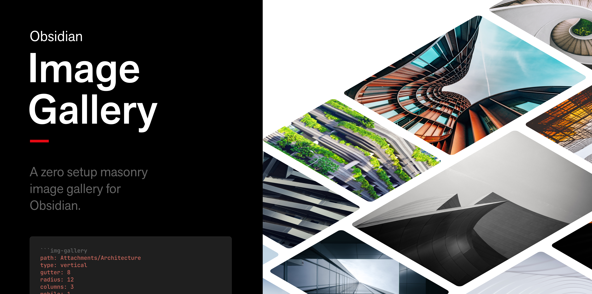
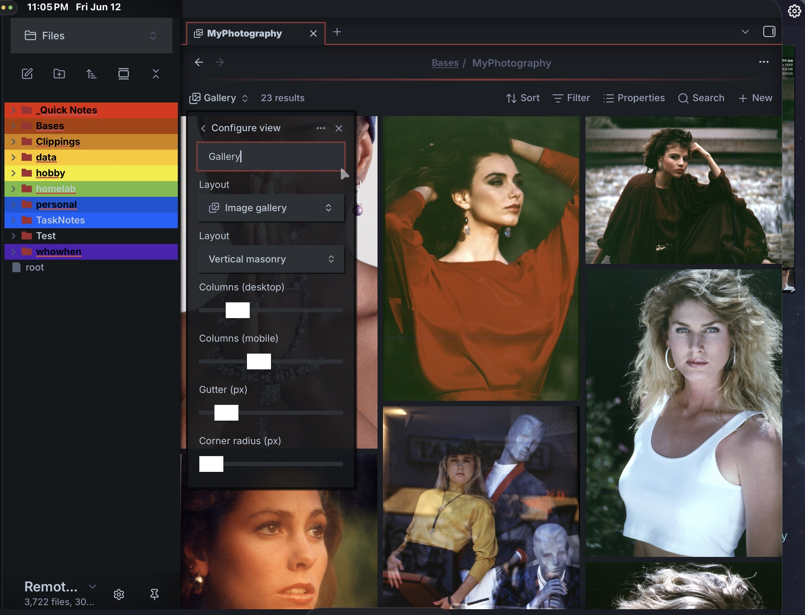
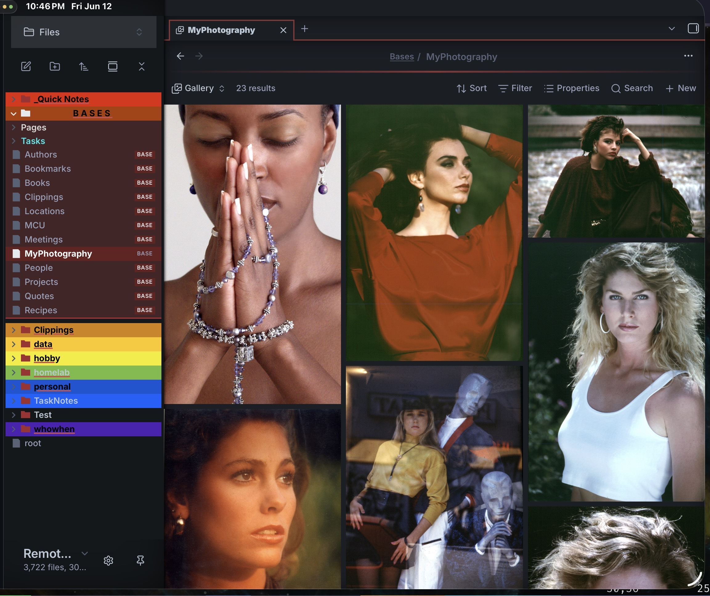
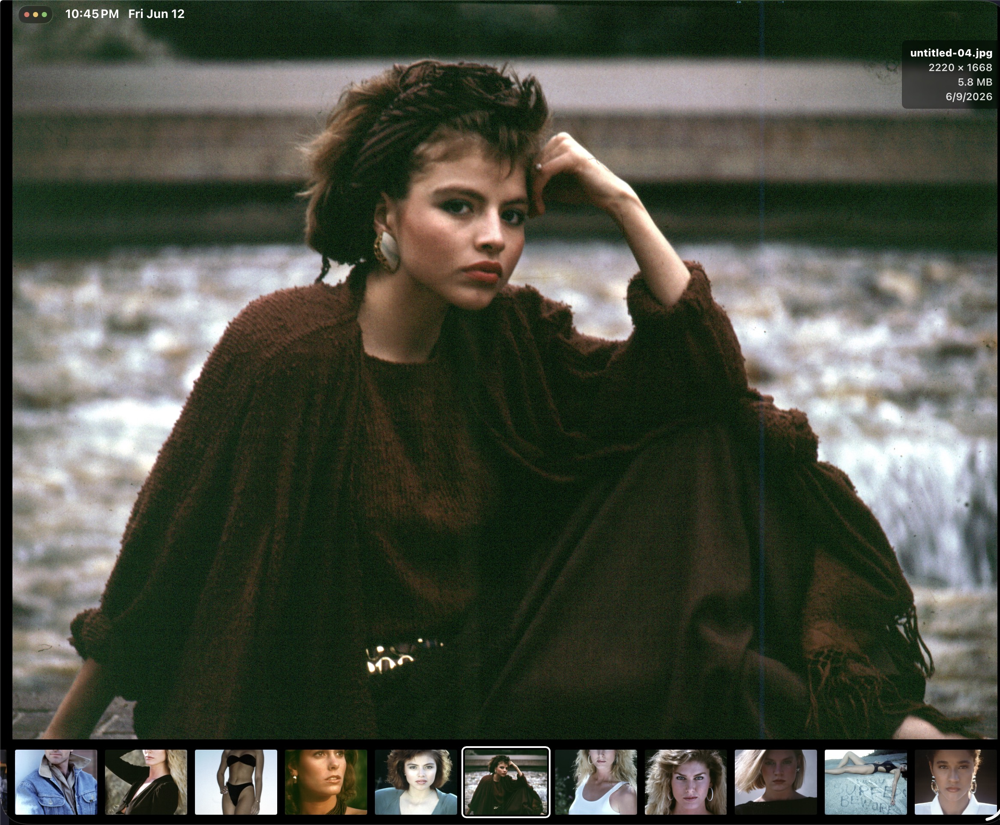

# Obsidian Bases Image Gallery
Obsidian Bases Image Gallery is a zero setup masonry image gallery for [Obsidian](https://obsidian.md/).
This is based off the work by [Luca Orio](https://lucaorio.com) — [Obsidian Image Gallery](https://github.com/lucaorio/obsidian-image-gallery) — but updated for the [Obsidian Bases](https://obsidian.md/help/bases) plugin. It makes it very easy to make a beautiful image gallery in your notes with very little effort.

**Table of Contents**
- [Requirements](#requirements)
- [Installation](#installation)
- [Setup](#setup)
	- [Example 01](#example-01)
	- [Example 02](#example-02)
- [Usage](#usage)
- [Configuration](#configuration)
- [Notes](#notes)
- [Changelog](#changelog)
- [Acknowledgments](#acknowledgments)
- [License](#license)
- [Contacts](#contacts)

## Requirements
- [Obsidian](https://obsidian.md/) `(ver >= 1.10.2)` — the Bases core plugin must be available.
- Images somewhere in your vault that you want to display.

## Installation

### Via BRAT (current beta)
The plugin is in beta and not yet in the community catalog, so install it with [BRAT](https://github.com/TfTHacker/obsidian42-brat):

1. In Obsidian, go to Settings → **Community plugins** → **Browse**, then install and enable **BRAT**.
2. Settings → **BRAT** → **Add beta plugin**.
3. Enter the repository `ghyatt/obsidian-bases-image-gallery` and click **Add Plugin**.
4. Enable **Bases Image Gallery** under Settings → Community plugins.

BRAT auto-updates you to each new beta release. For full usage and testing notes, see [BETA-TESTING.md](BETA-TESTING.md).

### Community plugin (once approved)
Once accepted into the catalog, search for **Bases Image Gallery** in Settings → [Community plugins](https://help.obsidian.md/Advanced+topics/Community+plugins#Discover+and+install+community+plugins) → Browse.

## Setup
Create an Obsidian Base (or place a Base in a note), and select the **"Image gallery"** view.
To create a dynamic gallery, add a filter to select which images to show. The configuration Obsidian generates will look something like the examples below.

### Example 01
**All images in vault**
- [base file](example-gallery-all-img.base) — as a standalone base file
- [embedded in note](example-gallery-all-img.md) — as a note

### Example 02
**Images in directories below this note's parent**
- [base file](example-gallery-subdirs.base) — as a standalone base file
- [embedded in note](example-gallery-subdirs.md) — as a note

## Usage
- Once the Base is created you can update configuration settings from the Base's view-config dialog.

- Take a look at [Configuration](#configuration) to see how to tweak the gallery; see the examples above for filtering possibilities.

The gallery renders directly in the Base view as soon as the Base's filters select one or more images — there is no code block to trigger and no preview mode to switch to. Add or remove a matching image in your vault and the gallery updates live.

- Clicking on an image will take you to a lightbox style screen.  

- In desktop you can click the X icon, or in mobile & desktop you can double click to exit back to the original masonry image display.

## Configuration
All options are set from the Base **view configuration** menu — there is no YAML to write by hand, and your choices are saved into the `.base` file automatically. Which images appear (and in what order) is controlled by the **Base's own filters and sort**, not by this view, so there are no `path`, `sortby`, or `sort` options.

| Option            | Default            | Range / Options       | Applies to | Description                                              |
| ----------------- | ------------------ | --------------------- | ---------- | ------------------------------------------------------- |
| Layout            | `Vertical masonry` | Vertical, Horizontal  | both       | Masonry orientation. Vertical is the recommended default (see [Notes](#notes)). |
| Columns (desktop) | `3`                | 1–10                  | vertical   | Number of columns on desktop.                           |
| Columns (mobile)  | `2`                | 1–6                   | vertical   | Number of columns on mobile.                            |
| Row height (px)   | `260`              | 50–1000               | horizontal | Height of each row.                                     |
| Gutter (px)       | `8`                | 0–64                  | both       | Spacing in px between the images.                       |
| Corner radius (px)| `0`                | 0–64                  | both       | Border radius in px of the images.                      |

## Notes
- Right now the photo date is the filesystem creation date, if people request it I will add in the photo EXIF data.
- Vertical layout works great and is the default. The horizontal layout currently renders in an unexpected way — it's a known bug being worked on, so stick with vertical for now.
- Make sure the images to embed have a reasonable size: generating a masonry with 60 4k photos will most likely slow down the app to a crawl!
- The images display can be from anywhere in your vault, just write Bases filter statements to select
- As mentioned in the [Requirements](#requirements) section, only local images are accepted. This plugin was designed with a specific use case in mind: create a gallery from a folder of images with as little setup as possible.

A note about ordering in the **vertical** layout: until a [true masonry layout](https://drafts.csswg.org/css-grid-3/) is available for native `css` grids, the visual ordering is approximate — elements flow top-to-bottom *within each column* rather than strictly left-to-right (see [this article](https://css-tricks.com/piecing-together-approaches-for-a-css-masonry-layout) for why). For most galleries this is fine; exact ordering is a known limitation of the CSS-column approach. The horizontal layout orders more intuitively but is still being fixed (see the bug note above).

## Changelog
0.1.3
  - Moved masonry layout styling from JavaScript into `styles.css` (configurable values passed as CSS custom properties).

0.1.2
  - Catalog-readiness: compliant manifest description; replaced an `innerHTML` clear with `empty()`.

0.1.1
  - Renamed the plugin `id` to `bases-image-gallery` for community-catalog compliance (ids cannot contain "obsidian").
  - Documented BRAT installation in the README.

0.1.0
  - initial release.

## Acknowledgments
- Top photo by [Luca Orio](https://lucaorio.com) images source [Unsplash](https://unsplash.com/s/photos/architecture).
- Other image by [Gilbert Hyatt](ghyatt@gmail.com) Photography
- Code based on the original work by [Luca Orio](https://lucaorio.com).

## License

Provided AS IS — like most Obsidian plugins this is just a hobby for me, but I hope you find it useful. You can file bugs or feature requests on [GitHub](https://github.com/ghyatt/obsidian-bases-image-gallery/issues). Thank you for taking a look at my plugin!

## Contacts
- Email: [ghyatt@gmail.com](mailto:ghyatt@gmail.com)
